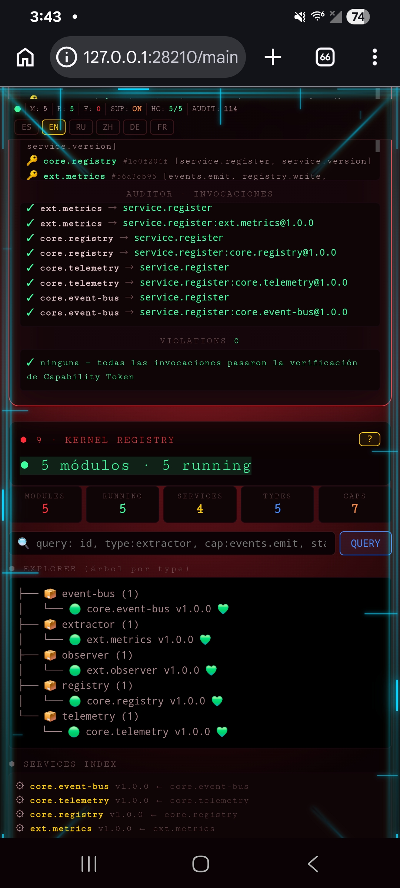
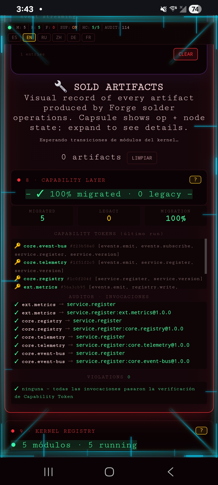
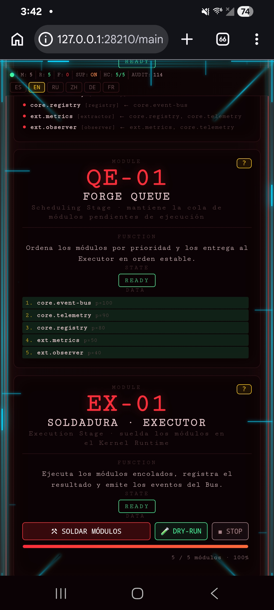
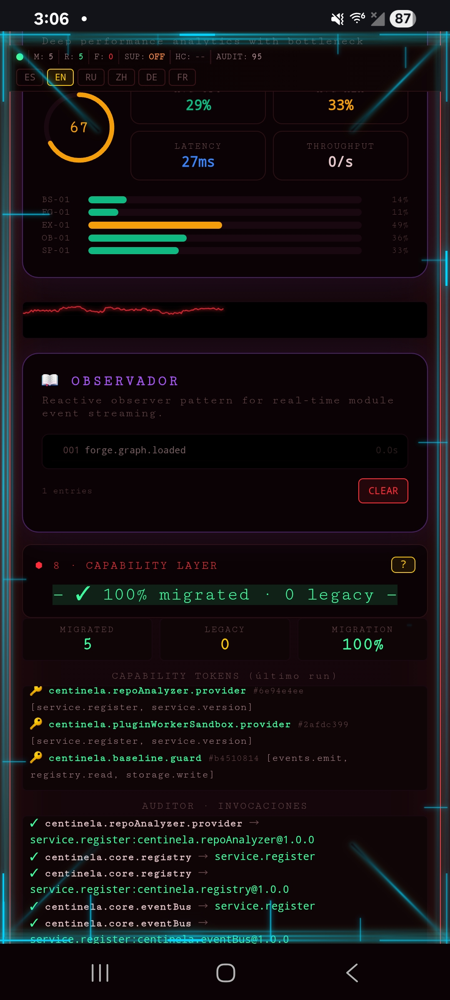

# Forge Kernel v3.2 RC-2

Un kernel frontend gobernado y con constitución ejecutable, escrito en
HTML/JS puro, con una Analysis Suite integrada y un QualityGate unificado.

## Autor

- **Yoandis Rodríguez**
- Email: curvadigital0@gmail.com

## Licencia

Licencia MIT

Copyright (c) 2026 Yoandis Rodríguez

Se concede permiso, de forma gratuita, a cualquier persona que obtenga
una copia de este software y de los archivos de documentación asociados
(el "Software"), a utilizar el Software sin restricción, incluyendo sin
limitación los derechos de uso, copia, modificación, fusión, publicación,
distribución, sublicenciamiento y/o venta de copias del Software, y a
permitir a las personas a las que se les proporcione el Software a hacer
lo mismo, sujeto a las siguientes condiciones:

El aviso de copyright anterior y este aviso de permiso se incluirán en
todas las copias o partes sustanciales del Software.

EL SOFTWARE SE PROPORCIONA "TAL CUAL", SIN GARANTÍA DE NINGÚN TIPO, EXPRESA
O IMPLÍCITA, INCLUYENDO PERO NO LIMITADO A GARANTÍAS DE COMERCIABILIDAD,
IDONEIDAD PARA UN PROPÓSITO PARTICULAR Y NO INFRACCIÓN. EN NINGÚN CASO LOS
AUTORES O TITULARES DEL COPYRIGHT SERÁN RESPONSABLES POR NINGUNA RECLAMACIÓN,
DAÑO U OTRA RESPONSABILIDAD, YA SEA EN UNA ACCIÓN DE CONTRATO, AGRAVIO O DE
OTRA FORMA, DERIVADA DE, FUERA DE O EN CONEXIÓN CON EL SOFTWARE O EL USO U
OTROS TRATOS EN EL SOFTWARE.

## Estado

- Forge Kernel v3.2 RC-2 — Gobernanza Completa
- 15/15 invariantes constitucionales
- 17 módulos enlazados (bound)
- 14/14 diagnósticos en evidencia durante el desarrollo (diag11, diag13,
  diag15, diag16, diag17, diag20, diag20a, diag21a, diag21b, diag22,
  diag23, diag24, diag25, diag26b) — ver *Diagnósticos y validación*
- QG-INT-01 cerrado: `QualityGateSwitch` y `kernelQG.runAll()` ahora comparten
  la misma semántica observable sobre `kernelQG.results`.
- Analysis Suite integrada (IIFE local, no es un módulo constitucional).

## Resumen de arquitectura

El kernel expone una superficie `window.IX` congelada (37 claves) que:

- declara y valida la constitución ejecutable (`IX.CONTRACT`, 5 contratos
  congelados: ModuleSpec, Signal, ModuleState, PerformanceModel,
  TelemetryStats);
- impone el punto único de entrada para nuevos módulos vía
  `IX.registerModule(spec)` (validado contra la constitución, congelado
  in situ);
- gobierna capacidades mediante un catálogo congelado `IX.CAPABILITIES`
  y los accesos `IX.hasCapability(code, capability)` /
  `IX.getCapability(code, capability)`;
- expone un mapa de versiones semánticas (`IX.VERSION`) y
  `IX.assertCompatibility(spec)` para rechazar contratos obsoletos.

La Analysis Suite se implementa como un controlador IIFE local
(`analysisUI`) que consume el grafo real del kernel (`forgeUI.graph`) y
los resultados del QualityGate (`kernelQG.results`). No está registrada
como módulo y no declara capacidades.

## Manifiesto Forge — Centinela 2B / Panel 100

Este repositorio incluye un manifiesto Forge canónico para la
integración de Centinela 2B con el Forge Kernel:

`manifests/centinela-2B-panel100-weld.v1.0.1.json`

### Identidad

| Campo              | Valor                                       |
|--------------------|---------------------------------------------|
| Nombre             | `centinela-2B-panel100-weld`                |
| Versión            | `1.0.1`                                     |
| Kernel requerido   | `0.0.0`                                     |
| Módulos            | `6`                                         |
| Estado             | Validado / publicado                        |
| Formato            | JSON compatible con Forge                   |
| Patch              | C                                           |
| Commit publicación | `2868f3d`                                   |

El manifiesto es el artefacto declarativo que describe los módulos de
Centinela que Forge debe validar, ordenar y soldar. No sustituye la
constitución del kernel: actúa como entrada de módulos para el
proceso de Forge Weld.

### Ubicación

El manifiesto canónico se encuentra en:

```text
manifests/
└── centinela-2B-panel100-weld.v1.0.1.json
```

Los usuarios que clonen este repositorio no necesitan reconstruir
manualmente el JSON ni crear un manifiesto desde cero. El archivo
incluido en este repositorio es el formato de referencia para esta
integración.

### Módulos declarados

El manifiesto contiene seis módulos:

| #  | ID                                       | Tipo              | Prioridad |
|----|------------------------------------------|-------------------|-----------|
| 1  | `centinela.core.eventBus`                | `event-bus`       | 100       |
| 2  | `centinela.core.registry`                | `registry`        | 100       |
| 3  | `centinela.repoAnalyzer.provider`        | `service-provider`| 90        |
| 4  | `centinela.pluginWorkerSandbox.provider` | `service-provider`| 90        |
| 5  | `centinela.baseline.guard`               | `baseline-guard`  | 50        |
| 6  | `centinela.panel100.integration`         | `ui-integration`  | 40        |

El orden de prioridad permite que Forge procese primero las piezas
fundamentales del EventBus y Registry, después los proveedores de
servicios y finalmente las capas dependientes.

### Dependencias

`centinela.baseline.guard` depende de:

- `centinela.core.eventBus`
- `centinela.core.registry`
- `centinela.repoAnalyzer.provider`
- `centinela.pluginWorkerSandbox.provider`

`centinela.panel100.integration` depende de:

- `centinela.core.eventBus`
- `centinela.core.registry`
- `centinela.repoAnalyzer.provider`
- `centinela.baseline.guard`

Forge utiliza estas relaciones para resolver el orden de ejecución
y validar que los servicios requeridos estén disponibles antes de
soldar los módulos.

### Capabilities

El manifiesto declara las capabilities que cada módulo puede
utilizar. Entre ellas se encuentran:

- `events.emit`
- `events.subscribe`
- `service.register`
- `service.version`
- `registry.read`
- `storage.write`

Las capabilities declaradas en el manifiesto no constituyen por sí
solas una autorización global. El kernel mantiene la gobernanza de
capacidades y valida las invocaciones mediante su sistema de
Capability Tokens.

### Requirements

Los módulos declaran requisitos explícitos sobre el kernel y sobre
los servicios proporcionados por otros módulos. Ejemplos:

- `kernel>=0.0.0`
- `service:centinela.repoAnalyzer>=1.0.0`
- `service:centinela.pluginWorkerSandbox>=1.0.0`
- `service:centinela.registry>=1.0.0`

Esto permite que Forge rechace una soldadura cuando los requisitos
declarados no puedan satisfacerse.

### Patch C — integración Panel 100

La versión `1.0.1` contiene el **Patch C** de
`centinela.panel100.integration`.

El objetivo principal del patch es eliminar la exportación paralela
del DOM mediante `document.documentElement.outerHTML`. En
particular:

1. `injectPanel100()` no inicia una descarga automáticamente.
2. `downloadFile()` ya no captura `outerHTML`.
3. `downloadFile()` no inventa ni depende de `window.__FORGE_WB__`
   o `window.__FORGE_LAST_TX__`.
4. La exportación canónica del artefacto se realiza mediante
   `ForgeWeldExport` después del `commit()` de la transacción.
5. El stub `downloadFile()` emite `panel100.downloaded` con
   `ok:false` y una razón explícita en lugar de generar un
   artefacto paralelo.

Esto mantiene una única ruta canónica de exportación para los
artefactos producidos por Forge Weld.

### Flujo recomendado para usuarios

Si has descargado o clonado este repositorio y quieres utilizar la
integración Centinela 2B / Panel 100:

1. Conserva `forge-in01.html` como el kernel objetivo.
2. Conserva el manifiesto en
   `manifests/centinela-2B-panel100-weld.v1.0.1.json`.
3. Carga el manifiesto mediante el flujo de entrada de Forge.
4. Deja que Forge valide el esquema, requirements, dependencias y
   capabilities.
5. Ejecuta la operación de soldadura desde Forge Workbench.
6. Utiliza el artefacto canónico generado después del commit.

No es necesario copiar manualmente los seis módulos dentro del HTML
ni reconstruir el JSON.

### Validación del manifiesto

El manifiesto publicado fue validado como JSON válido y contiene
exactamente seis módulos:

```text
JSON VALID: PASS
modules:    6
```

La identificación publicada del archivo corresponde a:

```text
name:     centinela-2B-panel100-weld
version:  1.0.1
modules:  6
```

**SHA-256 del archivo publicado en esta versión:**

```
3c51329d571d76be23b7d882d9fe99f2f702ba65f30523c3c01585414d17c9a8
```

Esta validación (identidad, hashes de los seis módulos y auditoría
de capabilities) se realizó durante el desarrollo. Este repositorio
no incluye todavía un script de verificación automática ejecutable
desde el clon; por ahora, la comprobación reproducible por un usuario
se limita a confirmar el SHA-256 anterior contra el archivo del
manifest.

### Compatibilidad y fuente de verdad

Para esta integración, el archivo:

```text
manifests/centinela-2B-panel100-weld.v1.0.1.json
```

es la **referencia canónica** del manifiesto publicado. No se
recomienda crear variantes con nombres ambiguos ni utilizar copias
modificadas como sustituto del manifiesto canónico sin incrementar
su versión.

Si el contrato de los módulos, sus capabilities, requirements,
dependencias o código cambia de forma incompatible, debe
publicarse una nueva versión del manifiesto.

### Publicación

La versión `1.0.1` fue publicada en `main` mediante el commit:

```
2868f3db4f09125de76d1373f9b9589dcdec7a32
```

## Módulos (17)

Cada módulo está declarado en `MODULE_SPECS` y se enlaza al arrancar
mediante `bindModule(code)`. Cada uno se identifica con un código
(por ejemplo `IN-01`) y está respaldado por un spec congelado. La
columna *Función* está tomada textualmente de la descripción
`data-ix-layer="function"` del módulo en el HTML.

| Código | Función |
|---|---|
| `IN-01` | Lee el archivo de manifiesto, valida el esquema y registra los módulos declarados en el Registry. |
| `DG-01` | Ordena topológicamente los módulos del Registry y muestra las dependencias entre ellos. |
| `QE-01` | Ordena los módulos por prioridad y los entrega al Executor en orden estable. |
| `EX-01` | Ejecuta los módulos encolados, registra el resultado y emite los eventos del Bus. |
| `TX-01` | Cada soldadura es una transacción: snapshot del runtime, ejecución, commit o rollback completo. |
| `SK-01` | Sin lógica de negocio · consume una señal del DOM y alcanza READY. |
| `ST-01` | Auto-monitoreo de módulos failed/stopped · Watchdog + política de reinicio. |
| `RG-01` | Mantiene el registro de módulos · Hash Merkle · Sincronización con Navigator. |
| `CP-01` | Búsqueda de comandos y paneles · Ejecuta navegación global. Estado = visibilidad del overlay (no contenido del input). |
| `OB-01` | Activity Log alimentado por EventBus · Vistas Timeline, Test Runner, Inspector. Solo lectura. |
| `AT-01` | Registro inmutable de operaciones · Cadena Merkle · Exportable y verificable. |
| `QG-01` | Quality Gate continuo · 7 prerrequisitos · interruptor ON/OFF. |
| `HC-01` | Sondas periódicas de salud por módulo · Métricas CPU/Mem/Latencia · Historial. |
| `PF-01` | Captura tiempo de soldadura, invocaciones, memoria estimada por módulo. Snapshot + Reset. |
| `LC-01` | Orquesta transiciones DECLARED→BOOTING→EXECUTING→RUNNING→STOPPED\|FAILED\|RESTARTING. Diagrama en vivo. |
| `PA-01` | Consume `IX.getObserveStats()` y aplica `IX.PerformanceModel.compute` (puro, determinista). Score + métricas + cuellos de botella. |
| `PA-02` | Registra transiciones (from→to) por código cuando `IX.getObserveStats()` reporta deltas. Buffer privado FIFO con cap 50. |

## Diagnósticos (14)

Cada diagnóstico es un script Node independiente que dirigió Playwright
contra el kernel durante el desarrollo y verificó invariantes. Los 14
diagnósticos se ejecutaron en el entorno de desarrollo (no en este
repositorio) y aportaron la evidencia de 14/14 PASS que acompaña a
este build. Ver *Diagnósticos y validación* abajo para el detalle del
alcance.

| Diagnóstico | Verifica |
|---|---|
| `diag11` | Open/closed: 5 módulos nuevos añadidos solo con HTML + spec, IX sin cambios, 15/15 invariantes. |
| `diag13` | `IX.observe()` expuesto, CP-01 + LC-01 migrados a observación declarativa, I13 se mantiene (ningún spec posee observación). |
| `diag15` | Sincronización del título + perfil lineal de solo-observación (los polls escalan linealmente con muestras de 1s). |
| `diag16` | 4 combinaciones de flags (notify × profile) + alias `silent:true`, stats congelados, sin fugas. |
| `diag17` | RQ-09 + RQ-10: ciclo de vida de observers e intervals equilibrado a cero bajo estrés de 1000 ciclos. |
| `diag20` | PA-01 + PA-02 nativos, sin regresión I13 / I14 / I15. |
| `diag20a` | Test unitario de `IX.PerformanceModel.compute`: puro, determinista, congelado, rangos razonables. |
| `diag21a` | Constitución honesta: 5 contratos congelados, 6 validadores, 17 módulos reales + 17 estados reales, todos pasan. |
| `diag21b` | Constitución resiste ataque: 10/10 intentos (reemplazar, mutar, borrar, redefinir) rechazados. |
| `diag22` | `IX.registerModule()` impuesto en el punto único de entrada: válido se congela, inválido se rechaza, colisión se bloquea con `allowReplace`. |
| `diag23` | Gobernanza de capacidades: catálogo congelado, formas binaria y parametrizada, lookup por `IX.hasCapability` / `IX.getCapability`. |
| `diag24` | Versionado semántico: `IX.VERSION` es un objeto congelado, `IX.assertCompatibility` rechaza contratos obsoletos. |
| `diag25` | Analysis Suite E2E: Dependencias, Seguridad, Cobertura y Refresh operan sobre datos reales del kernel (grafo + meta.raw + kernelQG.results). |
| `diag26b` | QG-INT-01 POST-fix: el switch y `runAll()` producen la misma semántica observable sobre `kernelQG.results`. |

## Diagnósticos y validación

El estado declarado de **Forge Kernel v3.2 RC-2** fue validado en el
entorno de desarrollo mediante diagnósticos independientes. Esos
diagnósticos (`diag11`, `diag13`, `diag15`, `diag16`, `diag17`,
`diag20`, `diag20a`, `diag21a`, `diag21b`, `diag22`, `diag23`,
`diag24`, `diag25`, `diag26b`) se ejecutaron contra el kernel
durante el proceso de desarrollo y aportaron la evidencia de
**14/14 PASS** que acompaña a este build.

Estos scripts **pertenecen al entorno de validación de desarrollo**
y **no forman parte del contenido publicado en este repositorio**.
Las rutas `/workspace/diag*.js` y `/workspace/run-diags.sh` se
mencionan aquí únicamente como referencia histórica y **no deben
interpretarse como instrucciones reproducibles** para una
instalación obtenida mediante `git clone` de este repositorio.

El resultado 14/14 PASS constituye **evidencia del estado validado
del build durante el desarrollo**, no una afirmación de que los
diagnósticos puedan ejecutarse directamente desde el repositorio
clonado.

### Reproducibilidad desde el clon

La única verificación del estado del build que un usuario puede
reproducir desde un clon de este repositorio es la confirmación del
**SHA-256 del manifest publicado**:

```
3c51329d571d76be23b7d882d9fe99f2f702ba65f30523c3c01585414d17c9a8
```

Ese valor se publica junto con la versión 1.0.1 del manifest y
constituye la fuente de verdad verificable de esa release.

## Reglas para contribuir

Estas reglas son las que han mantenido estable el proyecto hasta ahora.
Romperlas debe ser una decisión deliberada, no un accidente.

1. **La Constitución es ejecutable.** `IX.CONTRACT` (5 contratos
   congelados) es la fuente de verdad de cómo deben verse un módulo,
   una señal, un estado y un modelo de rendimiento válidos. Cualquier
   cambio en la forma de un contrato debe incrementar la versión
   correspondiente en `IX.VERSION`; los specs existentes que declaren
   la versión antigua serán rechazados por `IX.assertCompatibility`.

2. **Los módulos nuevos pasan por `IX.registerModule(spec)`.** La
   manipulación directa de `MODULE_SPECS` es un atajo. Los specs de
   bootstrap (declarados en el IIFE) están exentos porque son
   authored por el kernel y se enlazan al arrancar con
   `bindModule(code)`; las adiciones en tiempo de ejecución deben
   pasar por el punto de entrada y son validadas, congeladas y
   enrutadas.

3. **Las capacidades son gobernanza, no permisos.** Añadir una
   capacidad al catálogo `IX.CAPABILITIES` es una decisión a nivel
   de kernel. Los subsistemas (`IX.tx`, futuros `IX.storage`,
   `IX.export`) consultan `IX.hasCapability(code, capability)` y
   `IX.getCapability(code, capability)`. Nunca confían en el spec
   directamente.

4. **Los servicios de fondo son territorio del kernel.** `setInterval`,
   `requestAnimationFrame`, `new MutationObserver`, `__Poller` y
   llamadas a `refreshModule` dentro de `read()` están prohibidas
   por la invariante I13. La observación es asunto del kernel; un
   spec es puro.

5. **Diagnósticos antes de funcionalidades.** Cualquier cambio en una
   superficie pública (kernel, constitución, capacidades, versionado)
   debe ir acompañado de un diagnóstico que capture tanto el baseline
   (antes) como el estado post-cambio. `diag26a.baseline.out` se
   conserva como evidencia histórica inmutable; `diag26b` documenta
   la semántica post-fix.

## Archivos en este directorio

- `forge-in01.html` — el monolito del kernel (archivo único, ~13,150 líneas).
- `manifests/centinela-2B-panel100-weld.v1.0.1.json` — manifiesto
  canónico de la integración Centinela 2B · Panel 100, validado y
  publicado.
- `README.md` — este archivo.

## Reporte de errores

Si encuentras un error, por favor repórtalo por escrito a
**curvadigital0@gmail.com** incluyendo:

1. **Qué esperabas que pasara**
2. **Qué pasó realmente**
3. **Pasos para reproducirlo**

Esto ayuda a corregir el código de forma eficiente.

## Screenshots











 ## Contacto

Yoandis Rodríguez — curvadigital0@gmail.com
